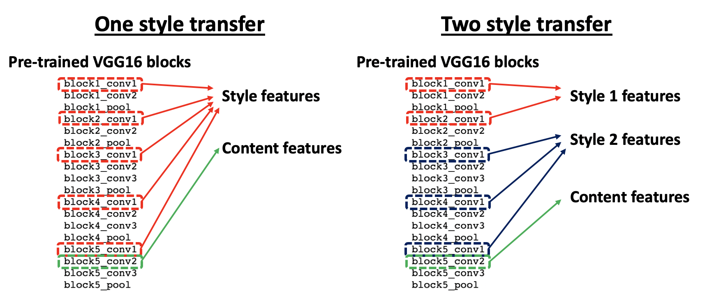
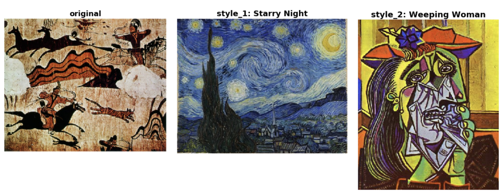
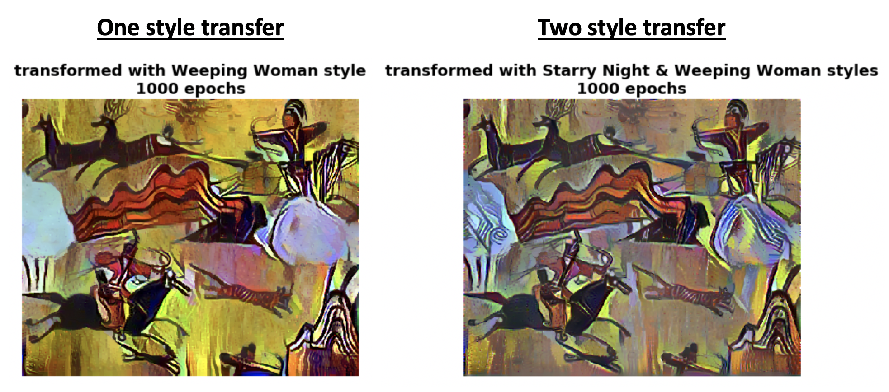
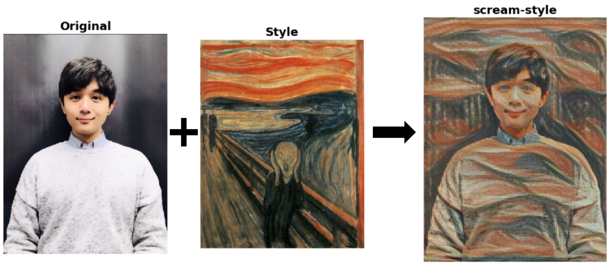
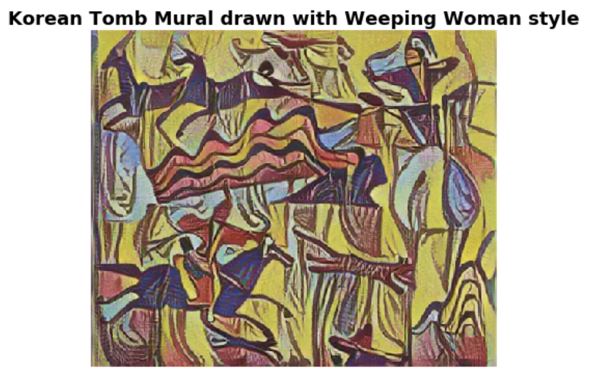
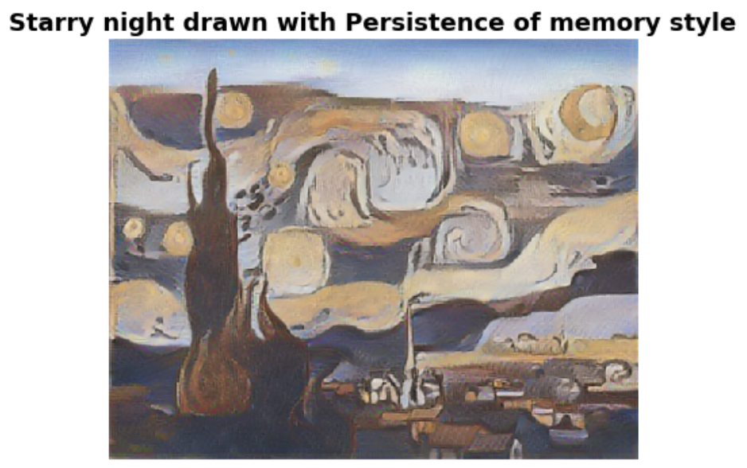

# NeuralStyleTransfer_custom

Thie repository presents:
* a VGG16-based custom **neural style transformation** (***one-style*** and ***two-style***)
* simple and fast implementation of neural style transformation (TF_Hub)

using *TensorFlow* and *OpenCV*.

For custom transformation, a pre-trained VGG16 model was used to extract styles and contents of an arbitrary image. For simple implementation, a pre-trained neural style transfer model was obtained from [TF Hub](https://tfhub.dev/google/magenta/arbitrary-image-stylization-v1-256/2).

Style art images were obtained from Google for demonstration purposes.

List of arts used:

* Goguryeo_tomb_mural - Unknown
* Les Demoiselles d'Avignon - Pablo Picasso
* Number 1 (Lavender Mist) - Jackson Pollock
* The Starry Night - Vincent van Gogh
* The Kiss - Gustav Klimt
* The Persistence of Memory - Salvador Dali
* The Scream - Edvard Munch
* The Weeping Woman - Pablo Picasso
* The Water Lily Pond - Claude Monet

## VGG16-based custom neural style transformation

### Two style transfer outline

For two-style transfer, depth and number of the style layers can be optimized for different results.

### Content image and two style images

### Example: one style transfer VS two style transfer

#### One-style transformation

#### Two-style transformation

Compared to the one-style transfer image (Weeping Woman), the effect of the second art is clearly visible in the two-style transfer image. In the two-style image:

* image is toned down in general
* some characteristics of 'Starry Night' such as blue tones and line patterns are overlayed in the image (especially in the white background)

Many hyperparameters are involved in this fitting process. Thus, based on specific purposes, hyperparameters can be adjusted to create unique results. For the fast implementation of general neural style transfer (limited to one-style), a pre-trained model on TF_hub can be utilized as described below.

## Simple implementation of neural style transformation using TF_Hub

### Profile style transfer outline

### Profile picture style transfer to various arts

### Example: art style transfers

